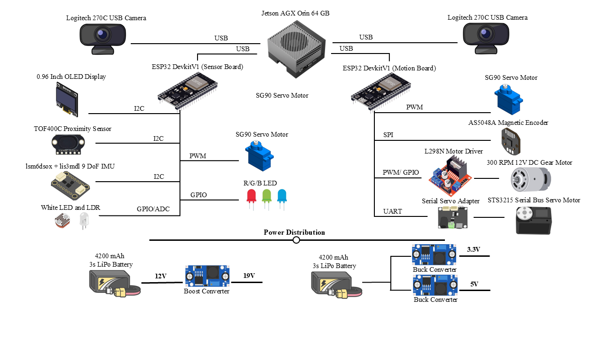

# Hardware

This directory contains the mechanical model, assembly drawing, system circuit diagram, component list, and firmware-derived ESP32 pin assignments.

## Files

| File | Description |
|---|---|
| [Argus_Omnimotus_Master_Multibody.SLDPRT](Argus_Omnimotus_Master_Multibody.SLDPRT) | Editable SolidWorks multibody CAD model |
| [Assembly_Drawing.jpg](Assembly_Drawing.jpg) | Side, bottom, top, and trimetric assembly views |
| [Circuit_Diagram.png](Circuit_Diagram.png) | Computing, sensing, actuation, communication, and power architecture |
| [BOM.csv](BOM.csv) | Machine-readable component list |
| [Pin_Map.md](Pin_Map.md) | GPIO, bus, address, and servo-ID assignments from the firmware |

## Assembly drawing

## Circuit diagram

The circuit diagram presents the system-level connections. Use [Pin_Map.md](Pin_Map.md) and the two sketches in [`firmware/`](../firmware/) for implemented GPIO assignments and serial commands. Board 01 handles the wheel encoders in the released firmware, while Board 02 handles the dispenser LDR.

The chassis is primarily 3D-printed PLA reinforced by two 5 mm steel rods. Open the `.SLDPRT` file in SolidWorks to access the editable bodies. The CAD file is stored using Git LFS.

[Return to repository overview](../README.md)
